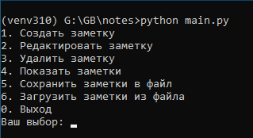
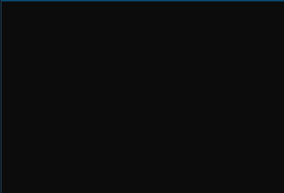
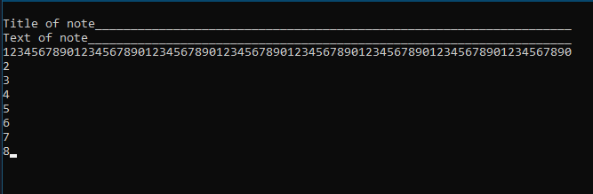
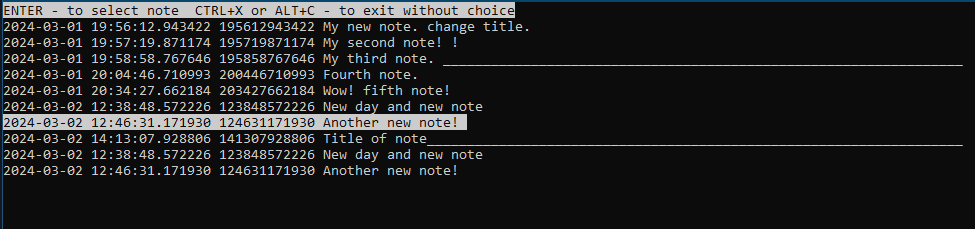
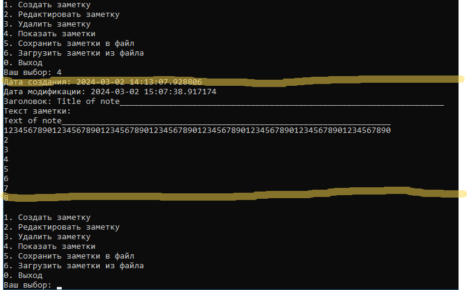

# Notes

Intermediate control work on the specialization block. Lesson 1. Notes Application (Python)

## Требования для запуска приложения

* Python версии не ниже 3.10.11
* curses версии не ниже 2.3.2
* система управления версиями git версии не ниже 2.39.2

## Подготовка к первому запуску

### Windows

1. Скачать Python с [официального сайта](https://www.python.org/downloads/windows/)
2. Установить Python на свой компьютер согласно [инструкции](https://www.python.org/about/gettingstarted/)
3. [Скачать](https://github.com/zephyrproject-rtos/windows-curses/releases) библиотеку windows-curses соответствующую
   версии Python
4. Клонировать приложение Notes на свой компьютер:

> ```git clone https://github.com/beemaster1972/notes.git``` <br>
> ```cd notes```

5. Создать виртуальное окружение Python:<br>```python -m venv venv```
6. Активировать виртуальное окружение:<br>```venv\scripts\activate.bat```
7. Установить библиотеку windows-curses:<br>```pip install "полный путь до библиотеки скачанной в пункте 3"```

### GNU/Linux

1. Скачать Python с [официального сайта](https://www.python.org/downloads/source/) или обновить уже
   установленный:<br>```sudo apt update && sudo apt upgrade```<br> для DEB версий. Для других версий смотрите
   Руководство по вашей версии GNU/Linux
2. Установить git:<br>```sudo apt update && sudo apt -y install git```
2. Клонировать приложение Notes на свой компьютер:

> ```git clone https://github.com/beemaster1972/notes.git``` <br>
> ```cd notes```

5. Создать виртуальное окружение Python:<br>```python -m venv venv```
6. Активировать виртуальное окружение:<br>```source venv\bin\activate.sh```

## Запуск приложения

```python main.py```

## Работа в приложении

### Главное меню



### Создание заметки

<br>
Откроется пустой экран с мерцающим курсором.<br>
На первой строке вводите **ЗАГОЛОВОК**
На следующих десяти строках можно вводить **текст** самой заметки.<br>
Размер **ЗАГОЛОВКА** 80 символов<br>
Размер **ТЕКСТА** 800 символов (10строк х 80 столбцов)<br>
Прим. Текст можно вводить только на латинице.<br>
<br>

#### Доступные сочетания клавиш

<table>
<thead>
<tr>
<th>Keystroke</th>
<th>Action</th>
</tr>
</thead>
<tbody>
<tr>
<td>Control-A</td>
<td>Перейти в верхний левый угол окна редактирования</td>
</tr>
<tr>
<td>Control-B</td>
<td>Курсор влево, переход на предыдущую строку если возможно.</td>
</tr>
<tr>
<td>Control-D</td>
<td>Удаление символа над курсором.</td>
</tr>
<tr>
<td>Control-E</td>
<td>Перейти в конец текущей строки.</td>
</tr>
<tr>
<td>Control-F</td>
<td>Курсор вправо, переход на следующую строку если возможно</td>
</tr>
<tr>
<td>Control-G</td>
<td>Завершить редактирование</td>
</tr>
<tr>
<td>Control-H</td>
<td>Удаление символа слева от курсора</td>
</tr>
<tr>
<td>Control-J</td>
<td>Вставка новой строки </td>
</tr>
<tr>
<td>Control-K</td>
<td>Очистка строки от курсора до конца строки.</td>
</tr>
<tr>
<td>Control-L</td>
<td>Обновление экрана.</td>
</tr>
<tr>
<td>Control-N</td>
<td>Курсор вниз.</td>
</tr>
<tr>
<td>Control-O</td>
<td>Вставка пустой строки.</td>
</tr>
<tr>
<td>Control-P</td>
<td>Курсор вверх</td>
</tr>
</tbody>
</table>
<br>
### Редактирование заметки

<br>
При выборе пункта 2 появится окно выбора заметки.<br>
Стрелками *Вверх* и *Вниз* выбираете заметку, которую хотите отредактировать. *Enter* для выбора, для возврата в главное меню нажмите *CTRL+X* или *ALT+C*.<br>
Редактирование заметки происходит в таком же окне как и создание заметки.

### Удаление заметки


Всё тоже самое, что и для редактирования, только при нажатии *Enter*`а выбранная заметка удалится без возможности восстановления.

### Показать заметки


Всё то же самое, что и для редактирования и для удаления, только при нажатии *Enter*`а выбранная заметка будет выведена в консоль.<br>

<br>

### Сохранить заметки в файл

Все заметки в формате json сохраняются в файл *notes.json*

### Загрузить заметки из файла

***ВНИМАНИЕ*** все не сохраненные изменения будут утеряны и загрузяться заметки из файла *notes.json*.

### Выход из приложения

При выходе из приложения все заметки будут автоматически сохранены в файл *notes.json*